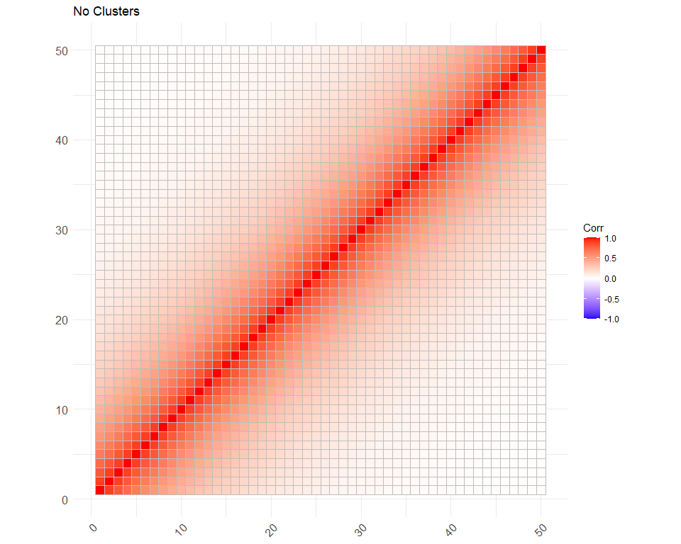
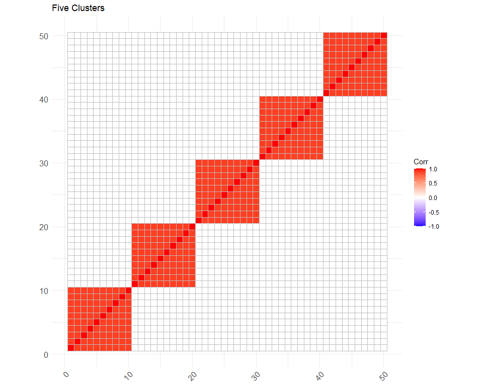
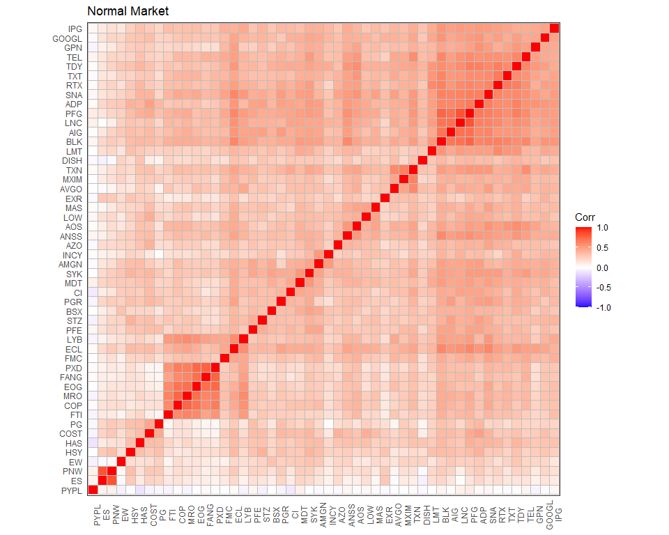

The Effect of Correlation Structure on Portfolio Optimisation
Performance
================
Nathan Potgieter

## Purpose

This document serves as the README for Nathan Potgieter’s Stellenbosch
University Masters thesis. This works sets out to perform Monte Carlo
simulations of five different financial market types, each with a unique
correlation structure, and then evaluate the performance of numerous
portfolio optimisation routines in each market type. This is done in
order to determine how a markets correlation structure impacts the
performance of portfolio optimisers. Ideally a set of heuristics will be
developed that can aid portfolio managers in their decision of which
portfolio optimiser to use.

## Creating Markets Types

This section sets out to design five distinct 50 by 50 market
correlation matrices, ranging from highly unrealistic, and purely
theoretical, to more realistic hierarchically clustered matrices.

``` r
# Loading required packages
library('pacman')
p_load(MCmarket, tidyverse, ggcorrplot)

#----------------------------------------------
# First look at the diagonal correlation matrix
# This seems far to simple and boring; Check with nico
#----------------------------------------------
corr_1 <- diag(50)
eigen_1 <- eigen(corr_1) # all eigenvalues are 1 and all eigenvectors contain only zero's
corr_1 %>% ggcorrplot(hc.order = TRUE, title = "Diagonal Matrix")
```


``` r
#---------------------------------------------
# Correlation matrix with no clusters
#---------------------------------------------
corr_2 <- gen_corr(D = 50, Clusters = "none")
eigen_2 <- eigen(corr_2)
corr_2 %>% ggcorrplot(title = "No Clusters")
```



``` r
#---------------------------------------------
# Correlation matrix with 5 clusters
#---------------------------------------------
corr_3 <- gen_corr(D = 50, Clusters = "non-overlapping", Num_Clusters = 5)
eigen_3 <- eigen(corr_3)
corr_3 %>% ggcorrplot(hc.order = TRUE, title = "Five Clusters")
```



``` r
#---------------------------------------------
# Correlation matrix with 10, 5 and 2 overlapping clusters
#---------------------------------------------
corr_4 <- gen_corr(D = 50, Clusters = "overlapping", Num_Clusters = c(10,5,2), Num_Layers = 3)
eigen_4 <- eigen(corr_4)
corr_4 %>% ggcorrplot(hc.order = TRUE, title = "Overlapping Clusters")
```


``` r
#-----------------------------------------------
# Some empirical correlation matrices - from S&P500
# See ??corr_mats for info on how dataset was compiled
# First looking at "normal market"
#-----------------------------------------------
corr_5 <- corr_mats$cor_normal[[2]]
eigen_5 <- eigen(corr_5)
corr_5 %>% ggcorrplot(hc.order = TRUE, title = "Normal Market") +
    theme_bw() +
  theme(axis.text.x=element_text(angle=90),
        axis.title = element_blank(),
        axis.ticks = element_blank())
```



``` r
#----------------------------------------------
# "stressed market"
#----------------------------------------------
corr_6 <- corr_mats$cor_stressed[[1]]
eigen_6 <- eigen(corr_6)
corr_6 %>% ggcorrplot(hc.order = TRUE, title = "Stressed Market")  +
    theme_bw() +
  theme(axis.text.x=element_text(angle=90),
        axis.title = element_blank(),
        axis.ticks = element_blank())
```


``` r
#----------------------------------------------
# "rally market"
#----------------------------------------------
corr_7 <- corr_mats$cor_rally[[1]]
eigen_7 <- eigen(corr_7)
corr_7 %>% ggcorrplot(hc.order = TRUE, title = "Rally Market")  +
    theme_bw() +
  theme(axis.text.x=element_text(angle=90),
        axis.title = element_blank(),
        axis.ticks = element_blank())
```


``` r
#------------------------------------------
# Data set of eigenvalues
#------------------------------------------
eigens <- tibble(corr_1 = eigen_1$values,
                 corr_2 = eigen_2$values,
                 corr_3 = eigen_3$values,
                 corr_4 = eigen_4$values,
                 corr_5 = eigen_5$values,
                 corr_6 = eigen_6$values,
                 corr_7 = eigen_7$values)
stargazer::stargazer(eigens, type = "html", summary = FALSE, rownames = FALSE, out.header = FALSE)
```

<table style="text-align:center">
<tr>
<td colspan="7" style="border-bottom: 1px solid black">
</td>
</tr>
<tr>
<td style="text-align:left">
corr\_1
</td>
<td>
corr\_2
</td>
<td>
corr\_3
</td>
<td>
corr\_4
</td>
<td>
corr\_5
</td>
<td>
corr\_6
</td>
<td>
corr\_7
</td>
</tr>
<tr>
<td colspan="7" style="border-bottom: 1px solid black">
</td>
</tr>
<tr>
<td style="text-align:left">
1
</td>
<td>
15.9314854814815
</td>
<td>
9.10399999999997
</td>
<td>
21.7077640640441
</td>
<td>
17.9875903709124
</td>
<td>
20.3527211745864
</td>
<td>
9.41974070116081
</td>
</tr>
<tr>
<td style="text-align:left">
1
</td>
<td>
10.3834516581524
</td>
<td>
9.09900000000004
</td>
<td>
6.72842712474618
</td>
<td>
3.27692468476541
</td>
<td>
2.53511962839199
</td>
<td>
4.66030051111939
</td>
</tr>
<tr>
<td style="text-align:left">
1
</td>
<td>
6.28368423546084
</td>
<td>
9.09900000000001
</td>
<td>
1.9
</td>
<td>
2.19563816392345
</td>
<td>
1.73127498518647
</td>
<td>
2.19024550036834
</td>
</tr>
<tr>
<td style="text-align:left">
1
</td>
<td>
3.91637700129354
</td>
<td>
9.099
</td>
<td>
1.9
</td>
<td>
1.50833857299485
</td>
<td>
1.55331907627788
</td>
<td>
2.03013531300827
</td>
</tr>
<tr>
<td style="text-align:left">
1
</td>
<td>
2.58681158653583
</td>
<td>
9.099
</td>
<td>
1.09223593595585
</td>
<td>
1.36586070924225
</td>
<td>
1.33352463747363
</td>
<td>
1.67086780394376
</td>
</tr>
<tr>
<td style="text-align:left">
1
</td>
<td>
1.80763641365065
</td>
<td>
0.100000000000027
</td>
<td>
1.07157287525381
</td>
<td>
1.29691659817773
</td>
<td>
1.19193571254432
</td>
<td>
1.46251073193213
</td>
</tr>
<tr>
<td style="text-align:left">
1
</td>
<td>
1.32458857872212
</td>
<td>
0.100000000000007
</td>
<td>
0.400000000000013
</td>
<td>
1.20301590202157
</td>
<td>
1.14371282698655
</td>
<td>
1.40449083965791
</td>
</tr>
<tr>
<td style="text-align:left">
1
</td>
<td>
1.00889729330058
</td>
<td>
0.100000000000006
</td>
<td>
0.400000000000005
</td>
<td>
1.17910393105169
</td>
<td>
1.1016705020716
</td>
<td>
1.26955080779303
</td>
</tr>
<tr>
<td style="text-align:left">
1
</td>
<td>
0.792988835496157
</td>
<td>
0.100000000000004
</td>
<td>
0.400000000000002
</td>
<td>
1.0607379630845
</td>
<td>
1.04558825802488
</td>
<td>
1.22230821785247
</td>
</tr>
<tr>
<td style="text-align:left">
1
</td>
<td>
0.639572479725403
</td>
<td>
0.100000000000003
</td>
<td>
0.400000000000001
</td>
<td>
0.998855688830631
</td>
<td>
1.02697952083861
</td>
<td>
1.20030206916769
</td>
</tr>
<tr>
<td style="text-align:left">
1
</td>
<td>
0.52701153518274
</td>
<td>
0.100000000000003
</td>
<td>
0.400000000000001
</td>
<td>
0.949102774027649
</td>
<td>
0.991626458526093
</td>
<td>
1.11988104814782
</td>
</tr>
<tr>
<td style="text-align:left">
1
</td>
<td>
0.442166520406587
</td>
<td>
0.100000000000002
</td>
<td>
0.400000000000001
</td>
<td>
0.840881075379877
</td>
<td>
0.900583050777299
</td>
<td>
1.10711679061107
</td>
</tr>
<tr>
<td style="text-align:left">
1
</td>
<td>
0.376730605548369
</td>
<td>
0.100000000000002
</td>
<td>
0.400000000000001
</td>
<td>
0.816666237563028
</td>
<td>
0.864107661036257
</td>
<td>
1.07264700357629
</td>
</tr>
<tr>
<td style="text-align:left">
1
</td>
<td>
0.325264210069989
</td>
<td>
0.100000000000002
</td>
<td>
0.400000000000001
</td>
<td>
0.804392604193695
</td>
<td>
0.840845708001474
</td>
<td>
1.02605819901313
</td>
</tr>
<tr>
<td style="text-align:left">
1
</td>
<td>
0.284094189325299
</td>
<td>
0.100000000000001
</td>
<td>
0.4
</td>
<td>
0.752884589154701
</td>
<td>
0.797410267263331
</td>
<td>
0.999172491855344
</td>
</tr>
<tr>
<td style="text-align:left">
1
</td>
<td>
0.250672532352246
</td>
<td>
0.100000000000001
</td>
<td>
0.4
</td>
<td>
0.734937868470818
</td>
<td>
0.74352748841243
</td>
<td>
0.927513603205893
</td>
</tr>
<tr>
<td style="text-align:left">
1
</td>
<td>
0.223189339386137
</td>
<td>
0.100000000000001
</td>
<td>
0.4
</td>
<td>
0.723525358288192
</td>
<td>
0.716767199832514
</td>
<td>
0.902657090692352
</td>
</tr>
<tr>
<td style="text-align:left">
1
</td>
<td>
0.200331771599181
</td>
<td>
0.100000000000001
</td>
<td>
0.4
</td>
<td>
0.68373897295558
</td>
<td>
0.68594077465814
</td>
<td>
0.883881420219146
</td>
</tr>
<tr>
<td style="text-align:left">
1
</td>
<td>
0.181129621930638
</td>
<td>
0.100000000000001
</td>
<td>
0.4
</td>
<td>
0.671796666188597
</td>
<td>
0.669512346791467
</td>
<td>
0.834220462206021
</td>
</tr>
<tr>
<td style="text-align:left">
1
</td>
<td>
0.164853846216822
</td>
<td>
0.100000000000001
</td>
<td>
0.4
</td>
<td>
0.650353325739224
</td>
<td>
0.60404527152651
</td>
<td>
0.790679317768347
</td>
</tr>
<tr>
<td style="text-align:left">
1
</td>
<td>
0.150948358700292
</td>
<td>
0.1
</td>
<td>
0.4
</td>
<td>
0.637555681345435
</td>
<td>
0.561918387699706
</td>
<td>
0.777061260206368
</td>
</tr>
<tr>
<td style="text-align:left">
1
</td>
<td>
0.138983236094596
</td>
<td>
0.1
</td>
<td>
0.4
</td>
<td>
0.587584165205836
</td>
<td>
0.554845049015579
</td>
<td>
0.739930202291003
</td>
</tr>
<tr>
<td style="text-align:left">
1
</td>
<td>
0.128622007608758
</td>
<td>
0.1
</td>
<td>
0.4
</td>
<td>
0.566479108953017
</td>
<td>
0.504692854229584
</td>
<td>
0.706371967201451
</td>
</tr>
<tr>
<td style="text-align:left">
1
</td>
<td>
0.119598401000907
</td>
<td>
0.1
</td>
<td>
0.4
</td>
<td>
0.552947704732491
</td>
<td>
0.497575253856361
</td>
<td>
0.696618414055087
</td>
</tr>
<tr>
<td style="text-align:left">
1
</td>
<td>
0.111699553969688
</td>
<td>
0.1
</td>
<td>
0.4
</td>
<td>
0.534797486803303
</td>
<td>
0.488777574432629
</td>
<td>
0.668970589283682
</td>
</tr>
<tr>
<td style="text-align:left">
1
</td>
<td>
0.104753720870575
</td>
<td>
0.1
</td>
<td>
0.4
</td>
<td>
0.507384700500706
</td>
<td>
0.455167072391526
</td>
<td>
0.649484705381341
</td>
</tr>
<tr>
<td style="text-align:left">
1
</td>
<td>
0.0986211535577101
</td>
<td>
0.1
</td>
<td>
0.4
</td>
<td>
0.464419632347644
</td>
<td>
0.423984995270662
</td>
<td>
0.630198972872735
</td>
</tr>
<tr>
<td style="text-align:left">
1
</td>
<td>
0.0931872555099588
</td>
<td>
0.1
</td>
<td>
0.4
</td>
<td>
0.445245793845045
</td>
<td>
0.419345099479949
</td>
<td>
0.599169089987332
</td>
</tr>
<tr>
<td style="text-align:left">
1
</td>
<td>
0.0883573855707667
</td>
<td>
0.0999999999999999
</td>
<td>
0.4
</td>
<td>
0.433550460011148
</td>
<td>
0.400302089926574
</td>
<td>
0.589900570021486
</td>
</tr>
<tr>
<td style="text-align:left">
1
</td>
<td>
0.0840528733833111
</td>
<td>
0.0999999999999998
</td>
<td>
0.4
</td>
<td>
0.417375631179807
</td>
<td>
0.380152001997049
</td>
<td>
0.581597099312074
</td>
</tr>
<tr>
<td style="text-align:left">
1
</td>
<td>
0.0802079349778959
</td>
<td>
0.0999999999999998
</td>
<td>
0.4
</td>
<td>
0.414797369899536
</td>
<td>
0.372538982046254
</td>
<td>
0.544832546357
</td>
</tr>
<tr>
<td style="text-align:left">
1
</td>
<td>
0.0767672641605616
</td>
<td>
0.0999999999999997
</td>
<td>
0.4
</td>
<td>
0.407451617903156
</td>
<td>
0.341348985852772
</td>
<td>
0.527223153390298
</td>
</tr>
<tr>
<td style="text-align:left">
1
</td>
<td>
0.0736841362999361
</td>
<td>
0.0999999999999996
</td>
<td>
0.4
</td>
<td>
0.384059794568853
</td>
<td>
0.311109094380561
</td>
<td>
0.517431063181104
</td>
</tr>
<tr>
<td style="text-align:left">
1
</td>
<td>
0.0709189042354689
</td>
<td>
0.0999999999999996
</td>
<td>
0.4
</td>
<td>
0.371005110031115
</td>
<td>
0.301023569232972
</td>
<td>
0.492509736269405
</td>
</tr>
<tr>
<td style="text-align:left">
1
</td>
<td>
0.0684377968961869
</td>
<td>
0.0999999999999994
</td>
<td>
0.4
</td>
<td>
0.334306588250489
</td>
<td>
0.295605305991943
</td>
<td>
0.479216264822991
</td>
</tr>
<tr>
<td style="text-align:left">
1
</td>
<td>
0.06621195354865
</td>
<td>
0.0999999999999993
</td>
<td>
0.4
</td>
<td>
0.313947561786831
</td>
<td>
0.289604833844303
</td>
<td>
0.468434100521277
</td>
</tr>
<tr>
<td style="text-align:left">
1
</td>
<td>
0.064216642910733
</td>
<td>
0.0999999999999992
</td>
<td>
0.4
</td>
<td>
0.297248184091847
</td>
<td>
0.266149912547115
</td>
<td>
0.435912845620979
</td>
</tr>
<tr>
<td style="text-align:left">
1
</td>
<td>
0.0624306284070253
</td>
<td>
0.0999999999999992
</td>
<td>
0.4
</td>
<td>
0.287111746711793
</td>
<td>
0.259581439211724
</td>
<td>
0.404712935304252
</td>
</tr>
<tr>
<td style="text-align:left">
1
</td>
<td>
0.0608356498049544
</td>
<td>
0.099999999999999
</td>
<td>
0.4
</td>
<td>
0.271074998365621
</td>
<td>
0.258684005260516
</td>
<td>
0.391830164487821
</td>
</tr>
<tr>
<td style="text-align:left">
1
</td>
<td>
0.0594159982019417
</td>
<td>
0.0999999999999988
</td>
<td>
0.399999999999999
</td>
<td>
0.268240308585551
</td>
<td>
0.250125373280967
</td>
<td>
0.370846126702867
</td>
</tr>
<tr>
<td style="text-align:left">
1
</td>
<td>
0.058158166431165
</td>
<td>
0.0999999999999987
</td>
<td>
0.399999999999999
</td>
<td>
0.251518309315871
</td>
<td>
0.222218720661033
</td>
<td>
0.363528804527212
</td>
</tr>
<tr>
<td style="text-align:left">
1
</td>
<td>
0.0570505608449746
</td>
<td>
0.0999999999999985
</td>
<td>
0.399999999999999
</td>
<td>
0.23100696044044
</td>
<td>
0.200152712124169
</td>
<td>
0.350484470824001
</td>
</tr>
<tr>
<td style="text-align:left">
1
</td>
<td>
0.0560832634296188
</td>
<td>
0.0999999999999981
</td>
<td>
0.399999999999999
</td>
<td>
0.21227333060072
</td>
<td>
0.18646724126646
</td>
<td>
0.309910399042466
</td>
</tr>
<tr>
<td style="text-align:left">
1
</td>
<td>
0.0552478355283503
</td>
<td>
0.0999999999999977
</td>
<td>
0.399999999999998
</td>
<td>
0.201308525099487
</td>
<td>
0.174944798819302
</td>
<td>
0.268054561653017
</td>
</tr>
<tr>
<td style="text-align:left">
1
</td>
<td>
0.0545371562676536
</td>
<td>
0.0999999999999974
</td>
<td>
0.399999999999998
</td>
<td>
0.198081460741381
</td>
<td>
0.167261901599837
</td>
<td>
0.261342932504302
</td>
</tr>
<tr>
<td style="text-align:left">
1
</td>
<td>
0.0539452902163459
</td>
<td>
0.0999999999999973
</td>
<td>
0.399999999999997
</td>
<td>
0.172413952230137
</td>
<td>
0.159884860788969
</td>
<td>
0.238539494948805
</td>
</tr>
<tr>
<td style="text-align:left">
1
</td>
<td>
0.0534673799516469
</td>
<td>
0.0999999999999961
</td>
<td>
-0.0999999999999991
</td>
<td>
0.165502290388187
</td>
<td>
0.127832502248759
</td>
<td>
0.233345292997629
</td>
</tr>
<tr>
<td style="text-align:left">
1
</td>
<td>
0.0530995601296693
</td>
<td>
0.0999999999999958
</td>
<td>
-0.0999999999999995
</td>
<td>
0.157904927881235
</td>
<td>
0.114536290473337
</td>
<td>
0.205964613059105
</td>
</tr>
<tr>
<td style="text-align:left">
1
</td>
<td>
0.0528388904133691
</td>
<td>
0.0999999999999956
</td>
<td>
-0.1
</td>
<td>
0.116105588940759
</td>
<td>
0.0971132165621308
</td>
<td>
0.175410221146056
</td>
</tr>
<tr>
<td style="text-align:left">
1
</td>
<td>
0.0526833052402197
</td>
<td>
0.0999999999999908
</td>
<td>
-0.100000000000001
</td>
<td>
0.0960389522766697
</td>
<td>
0.0868433262993879
</td>
<td>
0.126887478727635
</td>
</tr>
<tr>
<td colspan="7" style="border-bottom: 1px solid black">
</td>
</tr>
</table>

## Including Plots

You can also embed plots, for example:


Note that the `echo = FALSE` parameter was added to the code chunk to
prevent printing of the R code that generated the plot.
